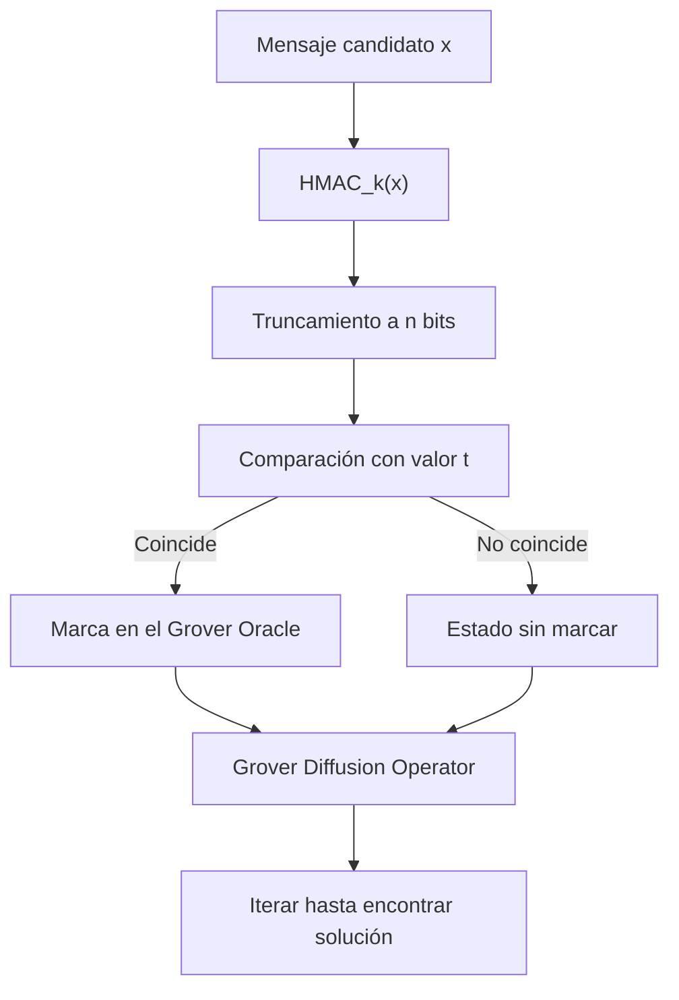

# Truncated Hash Oracle Lab (Quantum-Aware Edition)

## Introducción

En criptografía moderna, la seguridad de funciones hash y mecanismos de autenticación como **HMAC** se basa en la dificultad de encontrar colisiones o preimágenes.  
Sin embargo, con la computación cuántica surgen nuevos algoritmos, como **Grover's Algorithm**, que pueden reducir drásticamente el tiempo necesario para realizar estas búsquedas.

Este laboratorio combina conceptos de criptografía clásica y computación cuántica para demostrar cómo **el truncamiento de hashes** reduce el espacio de búsqueda y cómo un algoritmo cuántico puede aprovechar esta reducción.

---

## Fundamentos Matemáticos

### HMAC y SHA-256

Un **HMAC** (Hash-Based Message Authentication Code) con SHA-256 se define como:

```
HMAC_k(m) = SHA256( (k ⊕ opad) || SHA256( (k ⊕ ipad) || m ) )
```

Donde:
- `k` es la clave secreta.
- `m` es el mensaje.
- `opad` (outer padding) e `ipad` (inner padding) son constantes de 64 bytes definidas en RFC 2104.
- `⊕` representa la operación XOR.
- `||` denota concatenación.

En este laboratorio, el servidor no devuelve los 256 bits del HMAC, sino los **primeros n bits**:

```
h_trunc(m) = HMAC_k(m) mod 2^n
```

Esto significa que la información disponible está truncada, reduciendo el espacio de búsqueda.

---

## Reducción de Espacio de Búsqueda

En criptografía clásica:
- Espacio completo: `2^256`
- Con truncamiento a `n` bits: `2^n`

Matemáticamente, el problema se reduce a encontrar una `x` tal que:

```
h_trunc(x) = t
```

donde `t` es el valor truncado conocido.

---

## Grover's Algorithm

Grover's Algorithm permite resolver un problema de búsqueda no estructurada en **O(√N)**, mientras que clásicamente tomaría **O(N)**.

### Definición del Oráculo

El **Grover Oracle** se define como un operador que marca las entradas correctas:

```
O_f |x⟩ = (-1)^(f(x)) |x⟩
```

Donde:
```
f(x) = { 1 si h_trunc(x) = t
         0 en otro caso }
```

En este contexto, el oráculo verifica si el HMAC truncado de una entrada coincide con el valor objetivo `t`.

---

## Flujo de Ejecución del Laboratorio



---

## Complejidad Temporal

- **Búsqueda clásica:** `O(2^n)`
- **Búsqueda cuántica:** `O(2^(n/2))`

Por ejemplo, si `n = 40`:
- Clásico: ~ 1 billón de intentos.
- Cuántico: ~ 1 millón de intentos.

---

## Objetivo del Laboratorio

1. Entender cómo el truncamiento de hashes afecta la seguridad.
2. Implementar un **Grover Oracle** que identifique coincidencias de HMAC truncados.
3. Observar la reducción de tiempo de búsqueda con un enfoque cuántico.

---

## Notas finales

Este laboratorio **no es vulnerable por sí mismo** en un entorno clásico si `n` es suficientemente grande, pero demuestra el riesgo potencial en un escenario cuántico.

---
## Creditos

- Desarrollado por [**HackSyndicate**](https://www.hacksyndicate.xyz)  
- Coordinado por [**Mauro Carrillo (Pr00f)**](https://www.linkedin.com/in/mauro-carrillo-7a326a208)
